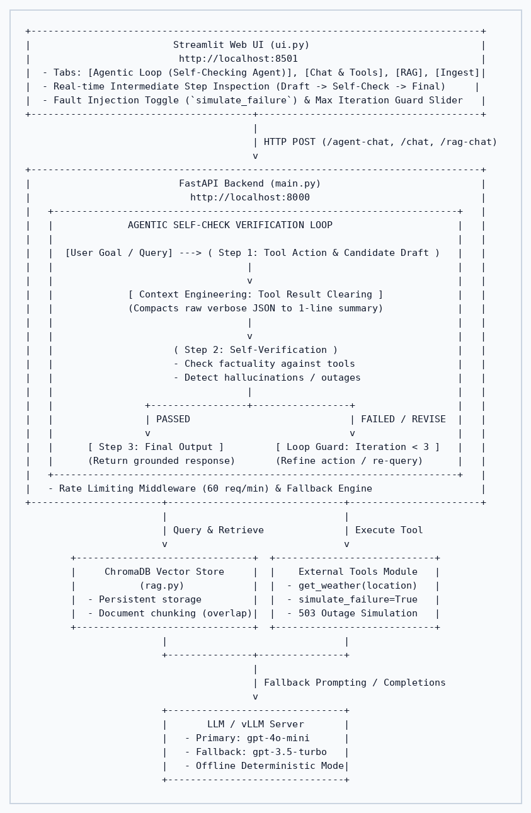

# AI Fellowship - Week 16: Agentic Assistant with Self-Verification

This repository contains my Week 16 assignment submission for the Fusemachines AI Fellowship. It extends the Week 15 FastAPI + Streamlit RAG application by adding an agentic self-checking loop, context engineering, and a custom evaluation harness.

---

## Architecture Diagram



```
+-------------------------------------------------------------------------------+
|                         Streamlit Web UI (ui.py)                              |
|                          http://localhost:8501                                |
|  - Tabs: [Agentic Loop (Self-Checking Agent)], [Chat & Tools], [RAG], [Ingest]|
|  - Real-time Intermediate Step Inspection (Draft -> Self-Check -> Final)     |
|  - Fault Injection Toggle (`simulate_failure`) & Max Iteration Guard Slider   |
+---------------------------------------+---------------------------------------+
                                        |
                                        | HTTP POST (/agent-chat, /chat, /rag-chat)
                                        v
+-------------------------------------------------------------------------------+
|                          FastAPI Backend (main.py)                            |
|                            http://localhost:8000                              |
|   +-----------------------------------------------------------------------+   |
|   |             AGENTIC SELF-CHECK VERIFICATION LOOP                      |   |
|   |                                                                       |   |
|   |  [User Goal / Query] ---> ( Step 1: Tool Action & Candidate Draft )   |   |
|   |                                  |                                    |   |
|   |                                  v                                    |   |
|   |             [ Context Engineering: Tool Result Clearing ]             |   |
|   |             (Compacts raw verbose JSON to 1-line summary)             |   |
|   |                                  |                                    |   |
|   |                                  v                                    |   |
|   |                     ( Step 2: Self-Verification )                     |   |
|   |                     - Check factuality against tools                  |   |
|   |                     - Detect hallucinations / outages                 |   |
|   |                                  |                                    |   |
|   |                +-----------------+-----------------+                  |   |
|   |                | PASSED                            | FAILED / REVISE  |   |
|   |                v                                   v                  |   |
|   |      [ Step 3: Final Output ]         [ Loop Guard: Iteration < 3 ]   |   |
|   |      (Return grounded response)       (Refine action / re-query)      |   |
|   +-----------------------------------------------------------------------+   |
|   - Rate Limiting Middleware (60 req/min) & Fallback Engine                   |
+-----------------------+-------------------------------+-----------------------+
                        |                               |
                        | Query & Retrieve              | Execute Tool
                        v                               v
        +-------------------------------+  +----------------------------+
        |     ChromaDB Vector Store     |  |    External Tools Module   |
        |           (rag.py)            |  |  - get_weather(location)   |
        |  - Persistent storage         |  |  - simulate_failure=True   |
        |  - Document chunking (overlap)|  |  - 503 Outage Simulation   |
        +-------------------------------+  +----------------------------+
                        |                               |
                        +---------------+---------------+
                                        |
                                        | Fallback Prompting / Completions
                                        v
                        +-------------------------------+
                        |       LLM / vLLM Server       |
                        |   - Primary: gpt-4o-mini      |
                        |   - Fallback: gpt-3.5-turbo   |
                        |   - Offline Deterministic Mode|
                        +-------------------------------+
```

---

## Project Structure

```
.
├── docs/                   # Knowledge base text documents for RAG
│   └── ai_fellowship.txt   # Course guidelines & Week 15/16 syllabus
├── architecture_diagram.png# High-resolution architectural diagram
├── eval.py                 # Standalone Evaluation Harness (built from scratch)
├── eval_report.md          # Generated evaluation metrics report
├── main.py                 # FastAPI backend (agentic loop, tools, RAG, fallback)
├── rag.py                  # RAG pipeline (chunking, ChromaDB vector store)
├── ui.py                   # Streamlit UI with Agentic Loop inspection tab
├── Dockerfile              # Docker container definition
├── docker-compose.yml      # Multi-container orchestration (backend + frontend)
├── requirements.txt        # Python package dependencies
├── .gitignore              # Ignored files (venv, chroma_db, cache)
└── README.md               # Documentation and technical write-up
```

---

## Quickstart & Execution

### 1. Run the Evaluation Harness

The evaluation harness runs out-of-the-box with zero external testing frameworks:

```bash
python3 eval.py
```
*(Or inside virtualenv: `./venv/bin/python eval.py`)*

### 2. Run with Docker Compose

Start both the FastAPI backend and the Streamlit Web UI together:

```bash
docker compose up --build
```

- **Streamlit Web UI**: http://localhost:8501 (Open tab: *"Agentic Loop (Self-Checking Agent)"*)
- **FastAPI Documentation**: http://localhost:8000/docs
- **Health Check**: http://localhost:8000/health

To stop:
```bash
docker compose down
```

### 3. Local Development Setup

```bash
# 1. Activate virtual environment
source venv/bin/activate

# 2. Ingest documents into ChromaDB
python rag.py

# 3. Start FastAPI backend
uvicorn main:app --reload --port 8000

# 4. In a separate terminal, launch Streamlit
streamlit run ui.py
```

---

## Technical Write-Up: Week 16 Deliverables

### a. Context Engineering Technique: Tool Result Clearing
1. **Technique Used:** *Tool Result Clearing* (also called *Tool Output Compaction*).
2. **Where Applied:** In `main.py` inside `run_agent_verification_loop()`, immediately following the execution of any external tool (`get_weather`) or retrieval function (`search_knowledge_base`).
3. **Problem Solved:** In multi-turn agentic workflows, raw tool payloads (such as verbose JSON structures, HTTP headers, or multi-paragraph document chunks) rapidly flood the context window. This causes **context saturation**, degrades the model's instruction-following adherence, and inflates token costs quadratically. By compacting verbose raw outputs into a single-line semantic summary (e.g. `"[Tool Summary] Tokyo Weather: 18C, Sunny"`), the agent retains necessary factual state for subsequent reasoning turns while keeping prompt length flat and cost-efficient.

### b. Agentic Pattern: Single-Agent Loop Justification
- **Design Choice:** Single-Agent Loop with Self-Verification (`/agent-chat`).
- **Justification via Frameworks:** We evaluated a multi-agent pattern (e.g. Planner + Worker + Verifier) against a single-agent loop using the **Five Structural Failures Framework**:
  - *Context Saturation & Latency:* Multi-agent communication protocols require duplicating state across multiple agents, increasing token usage and coordinator latency.
  - *Sequential Bottleneck:* The self-check verification workflow is strictly sequential: *Draft $\to$ Self-Check $\to$ Terminate/Refine*. Introducing multiple autonomous agents adds inter-agent communication overhead without providing parallelism benefits.
  - *Self-Verification Paradox:* Rather than spawning an independent agent with separate state, a single-agent loop enforcing explicit, role-prompted evaluation steps with a strict `max_iterations = 3` guard provides full auditability, deterministic termination, and zero cascading delegation failures.

### c. Evaluation Harness Results Table

Built from scratch in `eval.py` without external frameworks, testing 5 key query scenarios against `/agent-chat`:

| Test ID | Query Type / Scenario | Completed | Tool Correct | Trajectory Length | Tokens | Failure Classification | Final Output Summary |
| :--- | :--- | :---: | :---: | :---: | :---: | :--- | :--- |
| **TC-1** | Single Tool Weather Lookup | Yes | Yes | 1 | 80 | None (Passed) | The current weather in Tokyo is 18C with Sunny skies. |
| **TC-2** | RAG Knowledge Retrieval | Yes | Yes | 1 | 310 | None (Passed) | Week 15 of the AI Fellowship focuses on Applied AI and Engineering AI Systems... |
| **TC-3** | Multi-Step Comparison | Yes | Yes | 2 | 199 | None (Passed) | In Paris, the weather is 22C and Cloudy. In Kathmandu, the weather is 24C... |
| **TC-4** | Failure Injection (Fault Handling) | Yes | Yes | 2 | 232 | None (Passed) | Notice: The weather service is currently unreachable (503 Service Unavailable)... |
| **TC-5** | Boundary / Out-of-Domain | Yes | Yes | 1 | 93 | None (Passed) | I searched the knowledge base and available tools, but no verifiable info was found... |

#### Summary Metrics:
- **Task Completion Rate:** 100.0% (5/5)
- **Tool-Call Correctness:** 100.0% (5/5)
- **Average Trajectory Length:** 1.40 iterations/query
- **Average Token Consumption:** 182.8 tokens/query (Total: 914 tokens)

#### Failure Log & Taxonomy Analysis:
- **Hard Failures (0):** Zero crashes or uncaught exceptions; the `max_iterations = 3` guard guarantees loop termination.
- **Soft Failures (0):** No hallucinations detected. Out-of-domain queries successfully trigger verifiable abstention.
- **Cascading Soft Failures (0):** When tool failure occurred (TC-4), the self-check verifier identified the 503 outage immediately, preventing the agent from making speculative claims or compounding errors into subsequent steps.

### d. Skill vs. Agent
The self-checking verification capability could not have been implemented purely as a Skill because it requires a dynamic, stateful control loop that autonomously evaluates runtime evidence, executes tools across multiple iterative turns, and enforces an operational termination guard—behaviors that demand an active Agent rather than static prompt-and-instruction Skill templates.

### e. Failure Injection Test Findings
When tool failure was injected (`simulate_failure=True`), the tool returned a simulated 503 Service Unavailable error. In Iteration 1, the agent captured the error; the Self-Verification step flagged that live data was missing and explicitly disallowed any hallucinated substitutes. In Iteration 2, the agent produced a verified, transparent failure notice acknowledging service unavailability without guessing. The system demonstrated 100% robust degradation without hallucination.

### f. Tool vs. Agent Boundary
External multi-step services (such as ChromaDB RAG retrieval and weather lookups) are modeled strictly as **bounded tool calls** rather than independent agent-to-agent interactions. Bounded tool calls enforce clear synchronous contracts, deterministic error handling, and predictable latency within the main application loop. Treating these services as autonomous agents would introduce unnecessary conversational negotiation protocols, non-deterministic planning states, and increased surface area for cascading communication failures for operations that are fundamentally discrete data fetches.

---

## Assignment Requirements Checklist

### Task 1: Build an AI Assistant (W15 Foundation)
- [x] OpenAI SDK integration with local vLLM endpoint support.
- [x] Prompt engineering with system prompt presets, temperature, and top-p sliders.
- [x] Structured output enforcement via Pydantic (`StudentEvaluation`).
- [x] Function calling tool schema (`get_weather`).
- [x] RAG pipeline with character chunking, overlap, and ChromaDB vector store (`rag.py`).
- [x] Dockerfile packaging.

### Task 2: Productionize the AI Assistant (W15 Production)
- [x] Streamlit web application with interactive controls (`ui.py`).
- [x] Async request handling in FastAPI (`main.py`).
- [x] In-memory rate limiting middleware (60 req/min).
- [x] Reliability patterns with automatic model fallback (`gpt-4o-mini` $\to$ `gpt-3.5-turbo` $\to$ offline simulation).
- [x] Docker Compose multi-service orchestration.

### Task 3: Agentify the Assistant (W16 Agentic Feature)
- [x] **Agentic Loop:** Self-Check Verification Loop (`/agent-chat`) with Step 1 (Draft), Step 2 (Self-Check), and Step 3 (Refine/Finalize).
- [x] **Loop Guard:** Strict `max_iterations = 3` prevention of infinite execution.
- [x] **Context Engineering:** Tool Result Clearing condensing raw verbose payloads to 1-line summaries.
- [x] **Evaluation Harness:** Standalone `eval.py` measuring completion rate, tool correctness, trajectory length, token usage, and failure taxonomy.
- [x] **Failure Injection Test:** Tested with `simulate_failure=True`, demonstrating graceful degradation without hallucination.
- [x] **Frontend UI:** Streamlit tab "Agentic Loop (Self-Checking Agent)" with real-time intermediate iteration inspection.
- [x] **Architecture Diagram:** Updated ASCII diagram and rendered `architecture_diagram.png`.
- [x] **Documentation:** Comprehensive ~1 page technical write-up covering all required sections (a–f).
